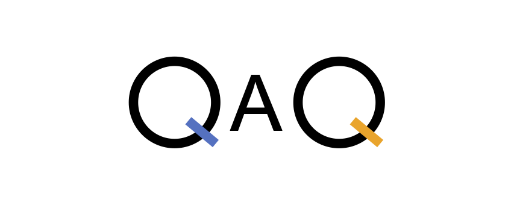

# QAQ: Quality Adaptive Quantization for LLM KV Cache

## Introduction

This is the official repository of [QAQ: Quality Adaptive Quantization for LLM KV Cache]().



### Brief abstract

As the need for longer context grows, a significant bottleneck in model deployment emerges due to the linear expansion of the Key-Value (KV) cache with the context length. Based on three key insights, we propose the QAQ, a $\underline{\text{Q}}\text{uality}$ $\underline{\text{A}}\text{daptive}$ $\underline{\text{Q}}\text{uantization}$ scheme for LLM KV Cache. QAQ achieves nearly $10 \times$ compression of KV cache with neglectable accuracy loss. 

For more details, please refer to our paper.

## Environment setup

### Step 1: Install dependencies

```bash
# Install from requirements.txt
pip install -r requirements.txt
# Alternatively, you can directly install all the dependent libraries
pip install numpy scipy torch transformers datasets accelerate matplotlib tqdm
```

### Step 2: Change GPU configurations

To support multi-GPU parallel evaluation, you need to modify `device_configs` in `src/config.py` according to your GPU configuration. Each entry in this list is used for a parallel evaluator. The first element of each entry is the main GPU device, where the quantization  process takes place; the second element is the maximum memory allowed for each device, which is passed to [accelerate.infer_auto_device_map](https://huggingface.co/docs/accelerate/v0.27.2/en/package_reference/big_modeling#accelerate.infer_auto_device_map).

### Step 3: Obtain access to LLAMA-2 weights

Accessing LLAMA-2 weights on Hugging Face needs to be granted by Meta. Please visit [the Meta website](https://llama.meta.com/llama-downloads/) and follow the instructions on the website. After that, you can customize the cache folder for model weights by modifying `hf_cache_dir` in `src/config.py`.

## How to use

There are three important classes:
- Class `Quantizer` in `src/quantizer.py`: This class is responsible for quantizing the key/value cache, supporting a variety of parameters. For detailed explanation of each parameter, see its constructor.
- Class `Evaluator` in `src/evaluator.py`: This class is responsible for evaluating the performance of a given pair of quantizers (one for key cache and one for value cache) on a given LLM model and a given dataset. Detailed results are cached in the file specified by `cache_file` in `src/config.py`.
- Class `Experiment` in `src/experiments/base.py`: This abstract class provides the basic functions to run a given set of evaluations in parallel. You can specify the set of evaluations to run by deriving the class and overriding the `quantizer_list` function. After all evaluations are done, the `process_result` in the derived class will be called with the evaluation results.

To run a new experiment, you need to derive the `Experiment` class, override the `quantizer_list` and `process_result` functions, and finally call the `run` function of your derived class in the entry point. There are some sample experiments in the `src/experiments` folder that are used in our paper.

# Citation

If you use this codebase, or QAQ inspires your work, please cite:

```markdown 
